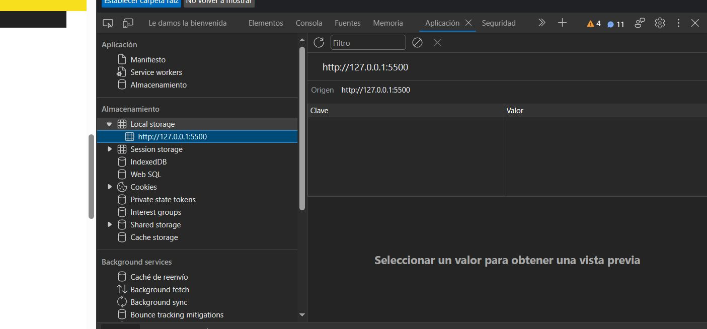

por cuestiones de usabilidad y de interaccion con el usuario por darles unamejor experiencia
a sus sitios, cuando hagan menus responsivos pongan el boton en la parte de abajo

para la seccion de alarma y reloj, no olvides descargarte un audio del internet y ponerlo en una carpeta llamada
ASSETS= activos, recursos ¿que es assets en informatica?

cada tecla tiene un codigo 
getBoundingClientRect(), // con esto detectamos la colicion 

siguiente ejercicio:
van a necesitar: programacion asincrona= temporizadores, parametros (selector donde va ir el elemento para que este 
actualizando su contenido {html o texcontent},fecha, Mensaje final ) cuando llega a su limite un feliz año nuevo

fechas validas en JS:
https://developer.mozilla.org/en-US/docs/Web/JavaScript/Reference/Global_Objects/Date#several_ways_to_create_a_date_object 

para hacer cualquier operacion con fechas o con tiempo en JS es importante comvertirlo a estampa de tiempos osea a milisegundos

para emojis:
https://emojipedia.org/ 

en la consola del navegador  pones new Date(); <--------------- esto es para saber la feha de hoy actual

slice(-2) : 019 =>19  // recorta antes de dos digitos

SIEGUIENTE:
cuando llegue a cierta distancia de alejemiento la barra de scroll vertical respecto del margen top
aparesca un boton  y cuando lo pulcemos nos lleve al inicio del documento

en la barra de desplasamiento horizontal no es bueno poner otro boton, ya que se considera de muy mal gusto que tu sitio no sea responsivo y te generé una barra horizontal imaginate que estas haciendo una precentacion tipo diapositiva, a lo mejor ahi si te interesa

en este capitulo vimos algunas caracteristicas del DOM Y del BOM

SIGUIENTE:
tema oscuro, tema claro // darkmode
generalmente este tipo de interacciones lo que hace es agregar una clase con los estilos oscuros a todo los elementos a los que queramos aplicar el dark mode generalmente puede ser que lo apliques al body o a la etiqueta html y con eso es mas que suficiente
imagina que debes aplicar esa clase dark mode a varios elementos de tu html,  para que tu no tengas que estar especificando que selectores van a cambiar a dark mode lo que vamos a hacer es ayudarnos de un data atribute, entonces cada elemento que tu quieras cambiarle los estilos cuando entre o salga del tema oscuro lo que vamos a hacer es agregar un atributo que se llama "dark"

muchos frameworks como Botstrap y https://get.foundation/index.html  https://get.foundation/templates.html se ayudan de los data-attributs para desencadenar cierta programacion en los componentes y que el usuario final ya no tenga que estar escribiendo codigo JS por su cuenta entonces estamos haciendo algo similar para el tema oscuro, le agregamos a los elementos que queramos eje: <a data-dark>algo</a>  de manera que ya no necesitamos especificar en el js "codigo duro" cuando precionas el boton que activa el modo oscuro agregale la clase dark-mode a la etiqueta html, tambien a mi header, pero tambien a mi enlace etc.
imagina que son varios elementos a los que van a aplicar ese cambio de estilo en lugar de estar indicando estaticamente en la programacion de tu funcion es mas facil que tu agregues tu dataAtribut y detectando que ese data atribut exista en los elemntos del dom  pues la programacion la ejecutas una sola vez. para que el usuario ya no tenga que estar escribiendo js por su cuenta, de manera que el usuario decida que *Elementos* quiere que se le aplique el tema oscuro

cuando tu aplicas el tema oscuro en una aplicacion o sitio la logica de interaccion diria  que a la siguiente vez que tu visites el sitio tendrias que conservar los estilos que tu le has dado

SIGUIENTE:
si el usuario actualiza la pagina el tema ya sea (claro u oscuro) debe mantenerse para este tipo de ejercicio, te recomiendo usar una API de navegador que se llama **STORAGE** #storage particularmente el local Storage nos permite es almacenar una variable en el disco duro de el usuario ()   

si tu quisieras controlar una sesion  que te estes conectando a un backend y guardar una variable de sesion y estar comprobando  y cada que pasas a una nueva session ver si ya caducó esa variable que viene del backend localStorage tiene aplicaciones muy importantes
eje: te preguntan tu pais de origen y el idioma al principio despues ya no te vuelven a preguntar, eso anteriormente lo hacia las cokies las cookies son mas inseguras y ademas el almacenamiento que tu puedes gurardar en cokies es mucho menor al que puedes guardar en localStorage 5Mb  otro es webStorage es como la sesio de php.

la Funcion de darkTheme la estamos desencadenando en el DOMContentLoaded no podemos tener un evento del mismo tipo que se ejecute en un evento del mismo tipo DOMContentLoaded(){DOMContentLoaded}
tenemos dos alternatimas: windowLOAD(espera a que se cargue todo los scripts) Y DOMcontenLoaded(espera tener el arbol cargado mas rapido)

getItem= obtiene los valores
setItem= establece(coloca) valores

SIGUIENTE:
responsive design: si un usuario accede desde su movil le ahoro que se se descargue toda las librerias imagenes y estilos que necista el navegador para poder visualizar el mapa y el video de youtube, y con eso le estariamos ahorando 2 o 3 megas de datos, en un viaje tratas de ahorar lo mas que puedas ¿verdad? responsible responsive design usar: eventos del BOM (eventos de la ventana) windows mach media